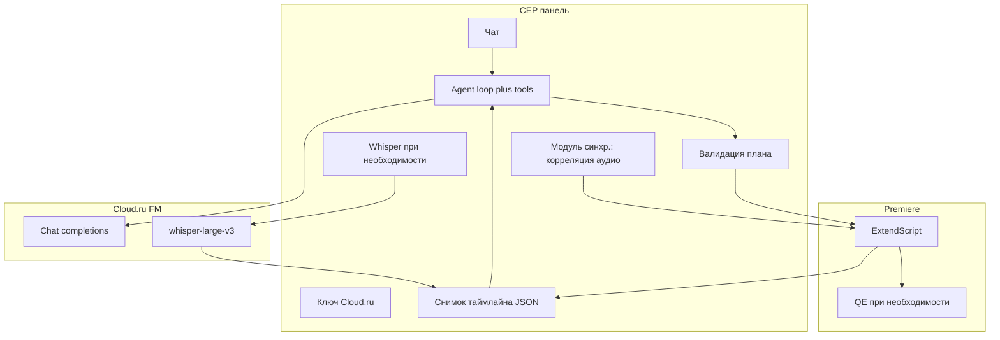

# ИИ-ассистент монтажа в Adobe Premiere Pro — базовый документ

Конспект референсов, локально установленных решений, границ возможностей Premiere Pro по официальному API и сопоставление с [Evolution Foundation Models на Cloud.ru](https://cloud.ru/products/evolution-foundation-models). Без выдуманных API: то, что не описано в [Premiere Pro Scripting Guide](https://ppro-scripting.docsforadobe.dev/), помечается как практика экосистемы (CEP/QE), а не как гарантия Adobe.

Задачи 1–6 и исключения по скоупу изложены ниже в этом файле; расширенный список внешних ссылок (MCP, auto-editor и т.д.) — в §2.

### Что уже есть в репозитории Extensions-LLM-Chat_Pr

| Задача из ТЗ (упрощённо) | В коде |
|--------------------------|--------|
| Порезать по таймкодам / ripple по секундам | ✅ `applyTimecodeEdits` (`ripple_delete_range`, trim in/out, `remove_clip`) |
| Склейка / мультикам / синхронизация по аудио | ❌ нет отдельных tools |
| Удаление пауз по громкости | ❌ нет; только смысловые интервалы по транскрипту |
| Смысловые вырезания по речи | ✅ транскрипт In–Out → кэш → `applyTranscriptCuts` |
| Склейка двух речевых фрагментов из разных роликов | ⚠️ частично только через последовательность вырезаний на одной секвенции; без импорта/склейки клипов как отдельной операции |

---

## Обязательный блок: задачи продукта

Ниже — **фиксированный перечень** возможностей ассистента. Они **не обязаны** выполняться по одной за раз: пользователь может сформулировать **один составной запрос** (черновой монтаж), например: «синхронизируй два дубля по звуку, убери паузы, вырежь вступление про X, собери на одной дорожке с клипом Y». Агент должен разложить это в **план** (транскрипт, снимок таймлайна, порядок tool-calls) и выполнить пакетно, с проверкой состояния между этапами.

1. **Порезать видео по таймкодам** — например: обрезать до 1 минуты, удалить всё после 3 минуты (по имени/ид клипа в проекте).
2. **Склеивать** одно видео с другим на таймлайне (порядок, дорожки, стык).
3. **Синхронизация** видео с аудио и **двух видео** по аудиодорожкам (в т.ч. подготовка к мультикамерному монтажу).
4. **Удалять паузы** (тишина по порогу громкости / длительности).
5. **Удалять конкретные речевые фрагменты** по смыслу запроса (например: «убери вступление про котиков») — через транскрипт + выбор интервалов + нарезка.
6. **Склеивать два осмысленных речевых фрагмента из разных видео** (например: кусок про котиков из видео 1 + кусок про собак из видео 2, остальное убрать).

**Вне скоупа (не входит в задачи продукта):** автоматический **B-roll из папки «по смыслу» к рассказу** без надёжной vision-модели в контуре Cloud.ru FM — **исключено** как нереализуемое в рамках заявленного стека; см. [страницу FM](https://cloud.ru/products/evolution-foundation-models) (мультимодальность — «скоро»).

---

## 1. Ваш запрос (цель продукта)

- Реализация **задач 1–6** внутри Premiere через CEP-панель: **нарезка**, **секвенции**, **звук**, **синхронизация/мультикам**, **удаление пауз**, **смысловая нарезка по речи** (транскрипт с таймкодами + структура таймлайна).
- «Мозги»: **Cloud.ru Evolution Foundation Models** (OpenAI-совместимый API, function calling, structured output — см. [страницу продукта](https://cloud.ru/products/evolution-foundation-models)).

---

## 2. Ссылки на референсы в сети

| Ресурс | Назначение |
|--------|------------|
| [Premiere Pro Scripting Guide](https://ppro-scripting.docsforadobe.dev/) | Официальная опора по **ExtendScript**: проект, секвенции, `TrackItem`, маркеры, импорт, экспорт и т.д. |
| [Premiere Pro UXP](https://developer.adobe.com/premiere-pro/uxp/) | Направление Adobe для новых плагинов; часть сценариев — через UXP, не всё дублируется в ExtendScript. |
| [RadimHruska / AI-caption-plugin-for-premiere-pro](https://github.com/RadimHruska/AI-caption-plugin-for-premiere-pro) | Пример **UXP**-панели (manifest 5). |
| [IsaiahDupree / premiere-pro-mcp](https://github.com/IsaiahDupree/premiere-pro-mcp) | **Node MCP + CEP Bridge** + ExtendScript/**QE DOM** (эталон охвата операций). |
| [leancoderkavy / premiere-pro-mcp](https://github.com/leancoderkavy/premiere-pro-mcp) | Форк с релизами. |
| [Premiere-Pro-Creator-Alliance / Premiere-Pro-New-Pack](https://github.com/Premiere-Pro-Creator-Alliance/Premiere-Pro-New-Pack) | В основном маркетинг; **не** инженерный референс. |
| [AutoPod](https://www.autopod.fm/) | CEP: мультикам, jump cut, соцклипы — эталон сценариев **без LLM**. |
| [Chat Video Pro](https://chatvideopro.com/) | Коммерческий ИИ-панельный ориентир. |
| [laozuzhen / chatvideo-yucut (V-Editor)](https://github.com/laozuzhen/chatvideo-yucut) | План → исполнение → проверка; транскрипт. |
| [Evolution Foundation Models (Cloud.ru)](https://cloud.ru/products/evolution-foundation-models) | Каталог моделей и API. |
| [playbooks.com — Adobe Premiere Pro MCP](https://playbooks.com/mcp/adobe-premiere-pro) | Каталог инструментов таймлайна (в т.ч. multicam) — ориентир по контрактам, не код этого репо. |
| [mikechambers/adb-mcp](https://github.com/mikechambers/adb-mcp) | MCP → UXP proxy → Premiere — зрелый пример цепочки. |
| [WyattBlue/auto-editor](https://github.com/WyattBlue/auto-editor) | CLI: нарезка по тишине, экспорт XML для Premiere. |
| [barefootford/buttercut](https://github.com/barefootford/buttercut) | Транскрипт + LLM + XML в Premiere (семантический монтаж). |

---

## 3. Локально развёрнутые решения (ваша машина)

| Путь | Что это |
|------|---------|
| `/Users/gmmelnikov/Library/Application Support/Adobe/CEP/extensions/Extensions LLM Chat` | **After Effects** CEP-агент: LLM ↔ tools ↔ ExtendScript, **Cloud.ru**. Шаблон для Premiere. |
| `/Library/Application Support/Adobe/CEP/extensions/com.autopod.jump.cut.editor` | AutoPod **Jump Cut** (PPRO 15.4+, Node, `premiere.jsx`). |
| `/Library/Application Support/Adobe/CEP/extensions/com.autopod.multi.camera.editor` | AutoPod **Multi-Camera** — **эталон для задачи 3** (см. §4.6). |
| `/Library/Application Support/Adobe/CEP/extensions/com.autopod.social.clip.creator` | AutoPod **Social Clip Creator**. |
| `/Library/Application Support/Adobe/CEP/extensions/com.autokroma.brawStudioPanelVisible` | **BRAW Studio** — опционально для контекста медиа. |

---

## 4. Что эти программы и API дают в плане монтажа

### 4.1 AutoPod ([autopod.fm](https://www.autopod.fm/))

- **Multi-Camera Editor** — сценарии синхронизации/мультикама (заявлено несколько камер/микрофонов).
- **Jump Cut Editor** — нарезка по **тишине**.
- **Social Clip Creator** — форматы, секвенция от in/out, масштаб/рефрейм.

### 4.2 Chat Video Pro, premiere-pro-mcp, AE «Extensions LLM Chat»

- Как в прежней версии документа: ориентир по UX; MCP — чеклист **tools**; AE-расширение — готовая **архитектура агента**.

### 4.3 Adobe Premiere (ExtendScript)

По [Scripting Guide](https://ppro-scripting.docsforadobe.dev/): проект, импорт, секвенции, `TrackItem` (время, ripple, скорость и т.д.), маркеры, XMP, Source Monitor, экспорт. Подробности — в гайде; caption-only сценарии частично уходят в [UXP](https://developer.adobe.com/premiere-pro/uxp/).

### 4.6 Задача 3 — синхронизация по аудио: рекомендации по реализации

Задача **не решается** одним промптом к LLM: нужен **алгоритм выравнивания** + вызовы Premiere (или UI-команды через скрипт, где доступно).

1. **Штатные средства Premiere (пользовательский эталон)**  
   Использовать как референс поведения: выделение клипов → **Synchronize…** (синхронизация по аудио; название пункта меню зависит от версии и языка интерфейса) → либо **Create Multi-Camera Source Sequence** с опцией опоры на **аудио**. Это то, что продукт должен **воспроизводить по результату** (смещения по таймлайну / мультикам-клип), даже если вызывается через ExtendScript/QE, а не через клик по меню.

2. **AutoPod Multi-Camera (установленное расширение)**  
   - **Инженерный разбор «с чёрного ящика»:** зафиксировать **до/после** в проекте (структура бинов, nested sequence, in/out, дорожки), шаги Undo, объём и порядок вызовов из панели.  
   - **Код:** `premiere.jsx` у поставщика часто **JSXBIN** — прямое чтение логики затруднено; декомпиляция может **противоречить EULA** AutoPod — ориентир: **повторение сценария своей реализацией**, а не копирование кода.  
   - Панельный JS (`main.js` / `function.js`) иногда читаемее: можно проследить **какие параметры** уходят в хост.

3. **Готовые и open-source подходы к вычислению лага**  
   - Вынуть **PCM/WAV** из обеих дорожек (экспорт аудио / ffmpeg в Node из панели) и найти **задержку кросс-корреляцией** (например SciPy/NumPy в sidecar Python, или библиотеки на JS с WASM — по выбору стека).  
   - Для выравнивания **речи по тексту** (если есть расшифровка): класс инструментов **forced alignment** (например [aeneas](https://github.com/readbeyond/aeneas)) — отдельный контур, не Cloud.ru FM.  
   - **MCP:** у [Adobe Premiere Pro MCP](https://playbooks.com/mcp/adobe-premiere-pro) есть `create_multicam_sequence` и др. — ориентир по контракту операций, в этом расширении не реализовано.

4. **Роль Cloud.ru FM в задаче 3**  
   Вспомогательная: выбрать **какие клипы** синхронизировать, порог уверенности, fallback; **не** замена математики синхронизации.

---

## 5. Что реализуемо скриптами + FM (задачи 1–6)

| Задача | Скрипты / Premiere | Cloud.ru FM |
|--------|-------------------|-------------|
| 1. Таймкоды | `TrackItem` in/out, start/end, ripple — [TrackItem](https://ppro-scripting.docsforadobe.dev/item/trackitem/) | NL → числа / structured output / tools |
| 2. Склейка | `importFiles`, размещение клипов, очередь на дорожке | План, имена клипов |
| 3. Синхр. по аудио | Алгоритм лага + мультикам/сдвиг (QE/скрипты по тестам); см. §4.6 | Маршрутизация, не ядро алгоритма |
| 4. Паузы | Анализ громкости в панели → split + ripple (как AutoPod Jump Cut) | Пороги, NL-настройки |
| 5. Вырезать речь | Whisper FM → интервалы → нарезка | `whisper-large-v3` + LLM + function calling |
| 6. Два фрагмента из разных роликов | Повтор 5 × 2 + импорт/монтаж на одной секвенции | Как в п. 5 |

Отдельный **MCP-сервер** опционален; панель может звать API напрямую.

---

## 6. Cloud.ru Evolution Foundation Models

Источник: [страница продукта](https://cloud.ru/products/evolution-foundation-models).

### 6.1 Категории, релевантные задачам 1–6

- **Текстовые LLM** — диалог, **function calling**, **structured output**, **reasoning**.
- **Эмбеддеры / реранкеры** — при необходимости fuzzy-поиск по фразам в транскрипте (**BAAI/bge-m3**, **Qwen3-Embedding**, реранкеры из каталога).
- **Audio → text:** `openai/whisper-large-v3` — задачи **5–6** и вспомогательно контекст для **4** (где границы фраз).

Модели **image→text** из каталога для задач **1–6** не требуются (B-roll исключён).

### 6.2 Сопоставление

| Подзадача | Модели / сервисы |
|-----------|------------------|
| План монтажа, многошаговый запрос, tools | Текстовые LLM с function calling (Qwen3-Coder, GigaChat, gpt-oss-120b, GLM и др. — по тестам) |
| JSON плана (таймкоды, действия) | Structured output + валидация в панели |
| Транскрипт | `openai/whisper-large-v3` |
| Поиск по тексту транскрипта | Эмбеддинги / реранк из каталога |

### 6.3 Лимиты (FAQ на сайте)

- Порядка **20 запросов/с** на сервисный API-ключ; длинные ролики — **кэш транскрипта**, батчинг.

---

## 7. Схема работы агента

**Шаги:** (1) запрос пользователя — возможно **композитный** (несколько из задач 1–6); (2) снимок проекта/секвенции; (3) при необходимости транскрипт и/или **синхро-модуль**; (4) LLM с tools; (5) evalScript + проверка; (6) маркеры при необходимости ([Marker](https://ppro-scripting.docsforadobe.dev/general/marker/)).

---

## 8. Риски

- ExtendScript: на [главной гайда](https://ppro-scripting.docsforadobe.dev/) — ориентация на UXP и поддержка ExtendScript **до сентября 2026**.
- **QE** — без официальной спецификации; регрессии по версии Premiere.
- Облако: **согласие** на отправку аудио/текста.

---

*При смене каталога моделей на [cloud.ru](https://cloud.ru/products/evolution-foundation-models) обновите §6. См. также [PROJECT.md](PROJECT.md), [premiere-extension-audit.md](premiere-extension-audit.md).*
